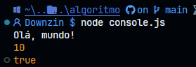
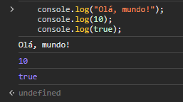
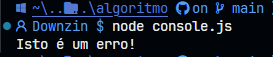
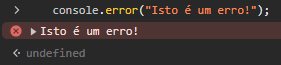
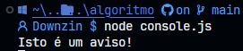
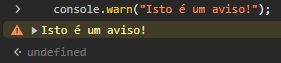
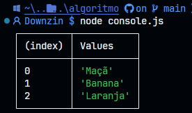
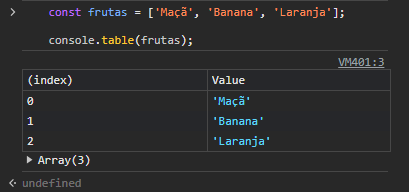
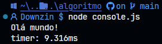
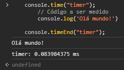

<div align="center">
    <h1>✨ Consoles コンソール 👾</h1>
    <p> Esse guia é nada mais de anotações sobre as aulas de Javascript da turma TI 24 feita por Matheus Dantas (O tal Dante) para colegas e aprendizados. Ao longo das aulas, terá uma source aberta no GitHub para acesso de códigos, exemplos e etc.  <strong>(¬‿¬)</strong></p>
    <div>
        <a href="../README.md">
            
        </a>
        
        
    </div>
</div>

<section align="center">
    <h2>✨ Introdução 導入</h2>
    <p> O console é frequentemente utilizado para depuração e visualização de saídas no desenvolvimento de aplicações JavaScript. A interface de console mais comum é console.log(), mas há várias outras disponíveis.
    </p>    
</section>

###

<h2 align="center" >💻 Funções do Console</h2>

- `console.log()`: Imprime mensagens no console. É útil para exibir valores de variáveis e mensagens de depuração.

```js
    console.log("Olá, mundo!"); // Imprime "Olá mundo!"
    console.log(10);            // Imprime "10"
    console.log(true);          // Imprime "true"
```

<table align="center">
   <td>
      
      <p align="center" style="margin: 0;">Terminal no Vscode</p>
   </td>
   <td>
     
     <p align="center" style="margin: 0;">Terminal no navegador</p>
    </td>
</table>

- `console.error()`: Imprime mensagens de erro.

```js
    console.error("Isto é um erro!"); // Imprime "Isto é um erro!"
```
<table align="center">
   <td>
      
      <p align="center" style="margin: 0;">Terminal no Vscode</p>
   </td>
   <td>
     
     <p align="center" style="margin: 0;">Terminal no navegador</p>
    </td>
</table>

- `console.warn()`: Imprime mensagens de aviso.

```js
    console.warn("Isto é um aviso!");
```

<table align="center">
   <td>
      
      <p align="center" style="margin: 0;">Terminal no Vscode</p>
   </td>
   <td>
     
     <p align="center" style="margin: 0;">Terminal no navegador</p>
    </td>
</table>

- `console.table()`: Exibe dados em formato de tabela.

```js
    const frutas = ['Maçã', 'Banana', 'Laranja'];

    console.table(frutas);
```

<table align="center">
   <td>
      
      <p align="center" style="margin: 0;">Terminal no Vscode</p>
   </td>
   <td>
     
     <p align="center" style="margin: 0;">Terminal no navegador</p>
    </td>
</table>

- `console.time()` e `console.timeEnd()`: Medem o tempo de execução de um bloco de código.

```js
    console.time("timer");
        // Código a ser medido
        console.log('Olá mundo!')

    console.timeEnd("timer");
```

<table align="center">
   <td>
      
      <p align="center" style="margin: 0;">Terminal no Vscode</p>
   </td>
   <td>
     
     <p align="center" style="margin: 0;">Terminal no navegador</p>
    </td>
</table>

<div align="center">
    <h2>💻 Considerações Finais 最終的な考慮事項</h2>
    <p>Os métodos de console no JavaScript são ferramentas poderosas para depuração e desenvolvimento. Eles oferecem várias formas de exibir informações, desde mensagens simples até tabelas detalhadas e rastreamentos de pilha. Utilizar esses métodos de maneira eficaz pode tornar o processo de desenvolvimento mais eficiente e organizado, ajudando a identificar e corrigir problemas rapidamente.</p>
</div>

---

<div align="center">
    <h2>💻 Veja mais</h2>
    <div style="display: flex; justify-content: center; align-items: flex-end;">
    <div style="text-align: center; margin-right: 10px;">
        <a href="../README.md">
            
        </a>  
        <a href="../variaveis/README.md">
            
        </a>
        <a href="../variaveis/zConcatenacao.md">
            
        </a>
        <a href="../variaveis/zVarLetConst.md">
            
        </a>        
    </div>
</div>


<section align="center">
    <h2>💻 Contato 接触</h2>
    <p>😀 Se você tiver sugestões, feedback ou quiser colaborar em algum projeto, ficarei feliz em ouvir de você! 😁</p>
    <p>
        <a href="mailto:dantasmatheus001@gmail.com">
            
        </a>
        <a href="https://www.instagram.com/downzin_" rel="nofollow">
            
        </a>
        <a href="https://x.com/DownloaderChan1" rel="nofollow">
            
        </a>
        <a href="https://discord.com/users/576935681167982595">
            
        </a>
    </p>
</section>
